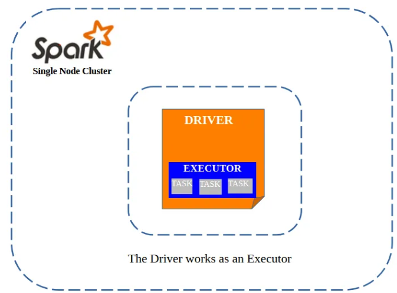
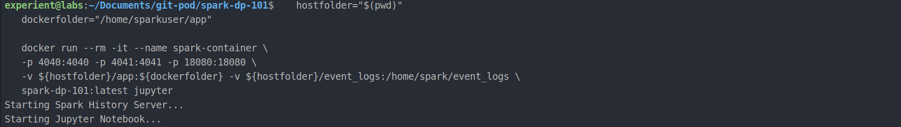
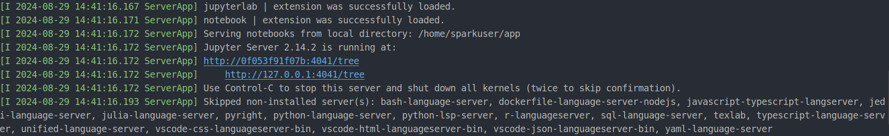
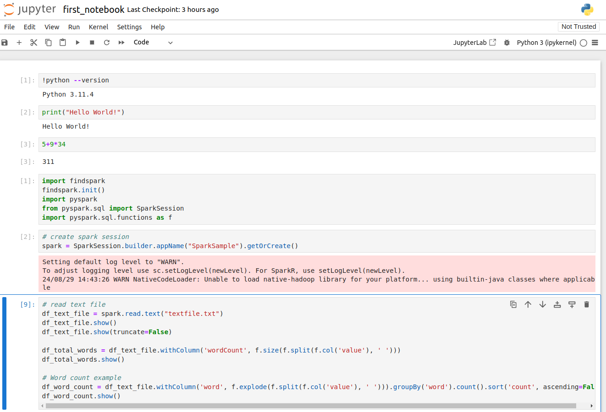
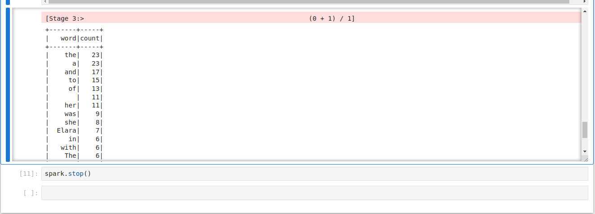
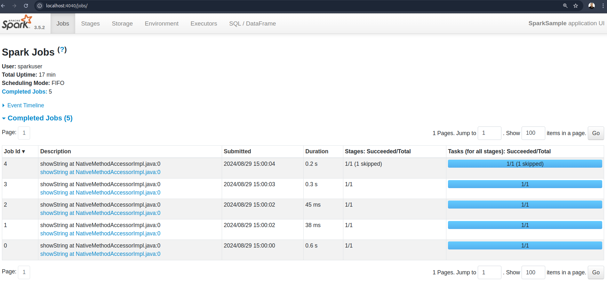
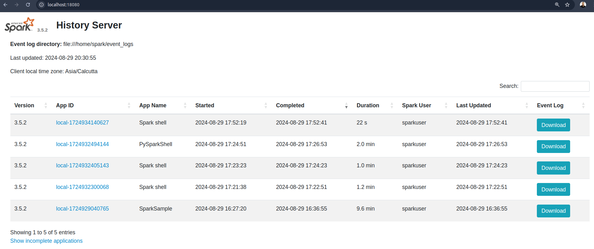

# Spark-DP-101

Spark Data Platform-101 is a Very basic Apache Spark setup in a Docker Container. 
This setup is designed for testing Apache spark and for learning purpose as an alternative to VM's 
which are big in volume and take too much resources. 
This docker application has all basic features of Apache Spark like:
1. Spark Shell 
2. Pyspark Shell 
3. Jupyter Notebook 
4. Spark UI and 
5. Spark History Server 

### Architecture

> 

### How to use it:
#### 1. Clone the repository in your machine using git clone command  
   ```commandline
   git clone git@github.com:experientlabs/spark-dp-101.git
   ```
#### 2. Next build the image by running below `docker build` command.  

   ```commandline
   docker build -t spark-dp-101 .
   ```
   - Here -t is to tag image with a name:`spark-dp-101`.
   - Here '.' is to run the build command in current directory. So dockerfile should be located in current directory.   

#### 3. Once image is built you need to run following command to run the container in jupyter notebook mode. 

   ```commandline
   hostfolder="$(pwd)"
   dockerfolder="/home/sparkuser/app"
   
   docker run --rm -it --name spark-container \
   -p 4040:4040 -p 4041:4041 -p 18080:18080 \
   -v ${hostfolder}/app:${dockerfolder} -v ${hostfolder}/event_logs:/home/spark/event_logs \
   spark-dp-101:latest jupyter
   ```

####  In order to run it in saprk-shell mode use below command (here last parameter is replaced with `spark-shell`). 

   ```commandline
   hostfolder="$(pwd)"
   dockerfolder="/home/sparkuser/app"
   
   docker run --rm -it --name spark-container \
   -p 4040:4040 -p 4041:4041 -p 18080:18080 \
   -v ${hostfolder}/app:${dockerfolder} -v ${hostfolder}/event_logs:/home/spark/event_logs \
   spark-dp-101:latest spark-shell
   ```

####  Similarly to run pyspark shell  use below command (here last parameter is replaced with `pyspark`). 

   ```commandline
   hostfolder="$(pwd)"
   dockerfolder="/home/sparkuser/app"
   
   docker run --rm -it --name spark-container \
   -p 4040:4040 -p 4041:4041 -p 18080:18080 \
   -v ${hostfolder}/app:${dockerfolder} -v ${hostfolder}/event_logs:/home/spark/event_logs \
   spark-dp-101:latest pyspark
   ```

#### Once your container is running you can use below urls to access various web UI's
1. Jupyter Notebook: http://localhost:4041
2. Spark UI: http://localhost:4040
3. Spark History Server: http://localhost:18080


Terminal window after running docker run command:

> 
> 

### Jupyter Notebook
http://127.0.0.1:4041/notebooks/first_notebook.ipynb
Running below code in jupyter notebook, in order to ascertain that spark is working fine in the container. 
```python
import findspark
findspark.init()
import pyspark
from pyspark.sql import SparkSession
import pyspark.sql.functions as f

# create spark session
spark = SparkSession.builder.appName("SparkSample").getOrCreate()

# read text file
df_text_file = spark.read.text("textfile.txt")
df_text_file.show()

df_total_words = df_text_file.withColumn('wordCount', f.size(f.split(f.col('value'), ' ')))
df_total_words.show()

# Word count example
df_word_count = df_text_file.withColumn('word', f.explode(f.split(f.col('value'), ' '))).groupBy('word').count().sort('count', ascending=False)
df_word_count.show()
```

> 

### Output of word count example: 

> 


### Spark UI:
http://localhost:4040/jobs/
> 


### Spark History Server: 
http://localhost:18080/
> 


Above features can also be accessed using docker-compose commands
- docker-compose up jupyter
- docker-compose up spark-shell
- docker-compose up pyspark
